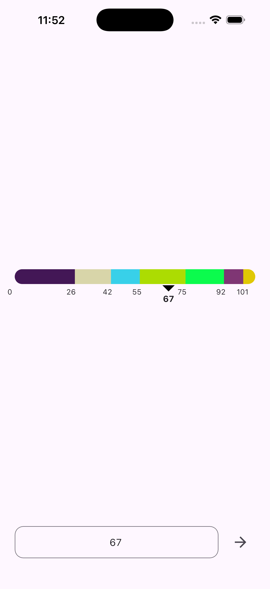

# flutter_horizontal_bar

A Flutter project that demonstrates a **dynamic horizontal range bar** with API-driven ranges, user input, and custom UI.

## Features

* Dynamic horizontal range bar with segments from API data.
* Random initial value between API-provided min and max.
* User can update value via a **TextField**.
* Custom pointer with triangle indicator.
* Provider-based state management.
* API integration using `http`.

## Getting Started

This project is a starting point for a Flutter application.

### Prerequisites

* Flutter SDK installed (>=3.0.0).
* Dart >=2.18.0.

### Packages Used

| Package                 | Purpose                                             |
| ----------------------- | --------------------------------------------------- |
| `provider`              | State management for updating UI based on API data. |
| `http`                  | For making API calls to fetch the ranges.           |
| `flutter/material.dart` | Core Flutter UI components.                         |

### Project Structure

```
lib/
├─ data/
│  ├─ models/
│  │  └─ range_model.dart      // RangeModel class to parse API JSON
│  └─ repository/
│     └─ range_repository.dart // Handles API requests
├─ viewmodels/
│  └─ rangeviewmodel.dart      // Provider + business logic
├─ widgets/
│  └─ triangle_painter.dart    // Custom painter for pointer triangle
└─ main.dart                   // Entry point
```

### How API Integration Works

1. **Repository** (`RangeRepository`) is responsible for calling the API:

```dart
import 'dart:convert';
import 'package:http/http.dart' as http;
import '../models/range_model.dart';

class RangeRepository {
  final String apiUrl;

  RangeRepository(this.apiUrl);

  Future<List<RangeModel>> getRanges() async {
    final response = await http.get(Uri.parse(apiUrl));
    if (response.statusCode == 200) {
      final List data = json.decode(response.body);
      return data.map((json) => RangeModel.fromJson(json)).toList();
    } else {
      throw Exception('Failed to load ranges');
    }
  }
}
```

2. **ViewModel** (`RangeViewModel`) manages state:

* Calls `repository.getRanges()` to fetch ranges.
* Dynamically sets `min` and `max` from API `start` and `end`.
* Picks a **random initial value** between min and max.
* Updates the controller and notifies UI.

```dart
final vm = RangeViewModel(RangeRepository('https://api.example.com/ranges'));
await vm.loadRanges(); // fetches ranges and updates UI
```

### UI Implementation

The main UI consists of:

1. **Horizontal Bar** (`_rangeBar`)

    * Segments colored dynamically based on API.
    * Pointer shows current value.
    * Labels show `start` of each segment.

2. **Bottom Controls**

    * TextField for entering a value.
    * Arrow button applies value to bar.

3. **Custom Triangle Pointer** (`TrianglePainter`)

    * Draws a small triangle above the current value.

```dart
AnimatedPositioned(
  duration: Duration(milliseconds: 400),
  left: pointerX - 10,
  top: 50,
  child: Column(
    children: [
      CustomPaint(
        size: Size(20, 10),
        painter: TrianglePainter(),
      ),
      SizedBox(height: 2),
      Text(vm.value!.toInt().toString()),
    ],
  ),
)
```

### Running the Project

1. Clone the repository.
2. Run `flutter pub get` to install dependencies.
3. Run the project:

```bash
flutter run
```

### Screenshots

Horizontal bar with dynamic ranges:



